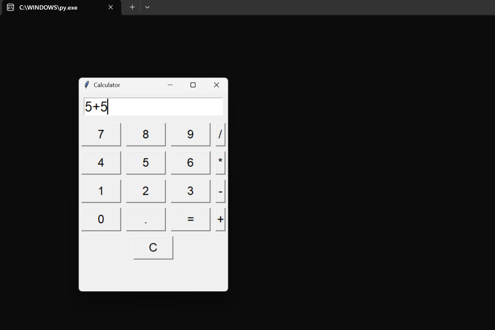

# 🧮 Python Calculator App



## 💻 Technologies Used
- Python 3
- Tkinter (for GUI)

## 📋 Overview
A basic calculator app built using Python and Tkinter. It performs basic arithmetic operations through an intuitive graphical user interface.

## ✅ Features
- GUI interface for user-friendly input
- Operations: Add, Subtract, Multiply, Divide
- Clear (C) button and error handling
- Responsive layout using frames and buttons

## 📁 Files
- `calculator.py`: Python source code
- `images/calculator-ui.png`: Preview image of the GUI

## ▶️ How to Run
1. Make sure Python is installed on your system
2. Run the app with:
```bash
python calculator.py
